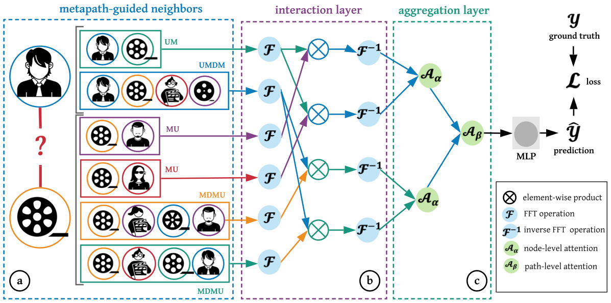

# Heterogeneous INteract and aggreGatE (GraphHINGE)
<p align="center">
  
  <br />
  <br />
</p>

This is a `pytorch` implementation of GraphHINGE model. This is the experiment code in the following work:


> An Efficient Neighborhood-based Interaction Model for Recommendation on Heterogeneous Graph </br>
Jiarui Jin, Jiarui Qin, Yuchen Fang, Kounianhua Du, Weinan Zhang, Yong Yu, Zheng Zhang, Alexander J. Smola. </br>
[KDD 2020](https://arxiv.org/pdf/2007.00216.pdf)

and its extended work:
> Learning Interaction Models of Structured Neighborhood on Heterogeneous Information Network </br>
Jiarui Jin, Kounianhua Du, Weinan Zhang, Jiarui Qin, Yuchen Fang, Yong Yu, Zheng Zhang, Alexander J. Smola. </br>
[TOIS](https://arxiv.org/pdf/2011.12683.pdf)

### Prerequisites
- Python 3.6
- Pytorch 1.8.0
- DGL 0.6.0

### References
If you find this work helpful in your research, please consider citing the following paper. The bibtex are listed below:
```bibtex
@inproceedings{jin2020efficient,
  title={An Efficient Neighborhood-based Interaction Model for Recommendation on Heterogeneous Graph},
  author={Jin, Jiarui and Qin, Jiarui and Fang, Yuchen and Du, Kounianhua and Zhang, Weinan and Yu, Yong and Zhang, Zheng and Smola, Alexander J},
  booktitle={Proceedings of the 26th ACM SIGKDD International Conference on Knowledge Discovery \& Data Mining},
  pages={75--84},
  year={2020}
}
```

```bibtex
@article{jin2020learning,
  title={Learning Interaction Models of Structured Neighborhood on Heterogeneous Information Network},
  author={Jin, Jiarui and Du, Kounianhua and Zhang, Weinan and Qin, Jiarui and Fang, Yuchen and Yu, Yong and Zhang, Zheng and Smola, Alexander J},
  journal={arXiv preprint arXiv:2011.12683},
  year={2020}
}
```
